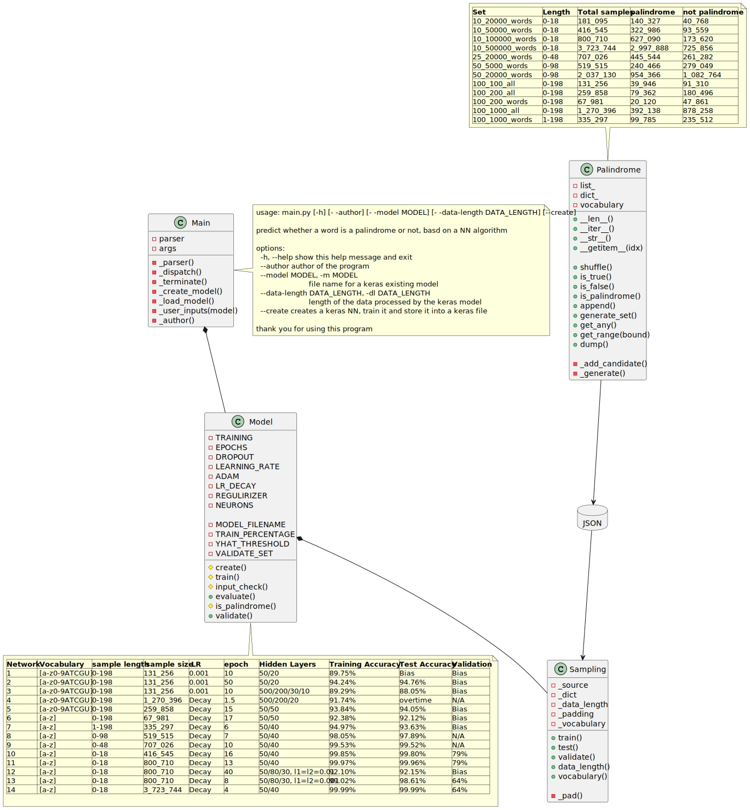

# Personal Project
## Basic Keras Neuronal Network to identify Palindromes

### Theme: Data Science
### Author: Bertrand B. Blanc
 
My investigative project aims at exploring the theme of data science with a neuronal network using supervised learning. The Python library I used is Keras from Tensorflow. I attempted to train a model to predict palindromes.

I generated a set of samples to train and test the model. 

Then created a neuronal network, and trained it.

According to the results, I modified the sampled data, the network architecture or the meta-parameters to obtain better results. I operated iteratively that way until I obtained satisfactory results.

Findings and results are presented in this [PDF document](palindrome.pdf). The following class diagram highlights the architecture of the Python program to create the training sets relying on data augmentation, and training the KERAS models.

Numerous NN were trained with more or less success according to the model. Different palindromes distributions (words, numbers, DNA/RNA) to train the models, different NN architectures (hidden layers, neurons by layers).
The inputs were vectorized according to the vocabulary used in the training distribution. The output is a basic 1-neuron layer with sigmoid activation function.
Bias was the main issue for many models. Overfitting was not an issue. The training-set/test-set ratio was generally 80%/20%. The validation-set was left apart.

I settled for one which has the highest validation results: model_13epochs_50-40.words-100000-18dl.keras

The following trace shows the results for candidates (which have never been seen by the model). The likely/unlikely threshold for the sigmoid function output was set to 0.5.

    $> py .\main.py --model .\keras-models\model_13epochs_50-40.words-100000-18dl.keras -dl 18
    model validation: 79%
    candidate (stop to exit): daddy
    "daddy" is unlikely to be a palindrome ([0.])
    candidate (stop to exit): dadda
    "dadda" is unlikely to be a palindrome ([0.01498113])
    candidate (stop to exit): daddad
    "daddad" is likely to be a palindrome ([0.9986217])

